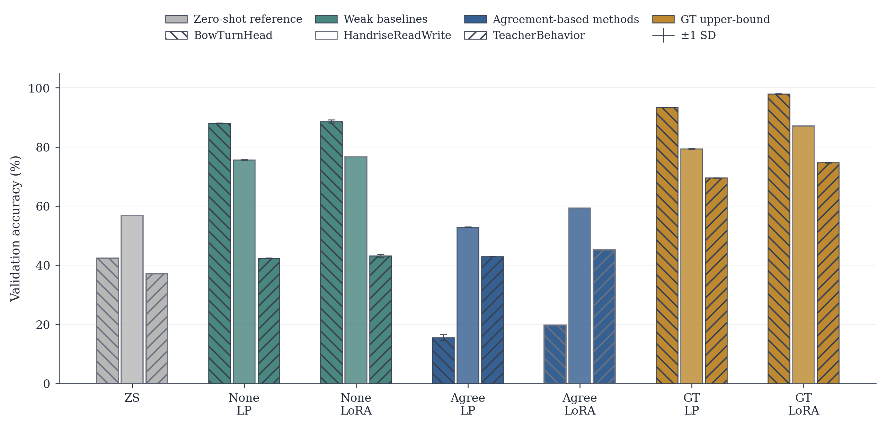
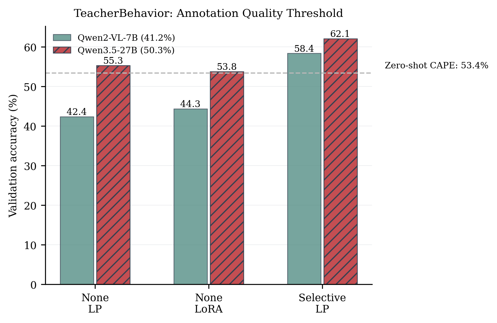

# LLM-Assisted Annotation for Classroom Behavior Recognition

**Can multimodal LLMs replace manual annotation for fine-grained classroom behavior recognition — and does it actually work when you try to train on those labels?**

This repository provides the complete experiment pipeline, results, and analysis code for our study. Every number in the paper can be traced back to a specific script, log file, and result JSON.

---

## What this research is about

Classroom behavior recognition matters: it enables automated teaching quality assessment, real-time feedback, and large-scale pedagogical research. But the bottleneck has always been **annotation cost** — frame-by-frame labeling of classroom videos requires domain experts and is prohibitively expensive at scale.

We test a simple but underexplored idea:

> **Use multimodal LLMs (Qwen2-VL, LLaVA) to generate pseudo-labels for bbox-cropped classroom images, then fine-tune CLIP on those labels.**

The question is not whether LLM labels are perfect (they aren't). The question is whether they are **good enough to train a downstream model that beats zero-shot CLIP**.

### The pipeline

```
Classroom video frames
    → YOLO bbox detection
    → Multimodal LLM annotation (Qwen2-VL + LLaVA)
    → Pseudo-label filtering (none / dual-model agreement)
    → CLIP ViT-L/14 fine-tuning (linear probe / LoRA)
    → Evaluation on 3 classroom behavior datasets
```

### Main result table (Table 1 in paper)

Repeated-seed validation accuracy (mean ± std, 5 seeds) for CLIP ViT-L/14 fine-tuned under three label sources and two training modes.

| Dataset | ZS | None LP | None LoRA | Agree LP | Agree LoRA | GT LP | GT LoRA |
|---------|:---:|:-------:|:---------:|:--------:|:----------:|:-----:|:-------:|
| **BowTurnHead** (2-class) | 42.37 | 88.02±0.12 | 88.65±0.52 | 15.53±1.00 | 19.69 | 93.35±0.08 | **97.91±0.10** |
| **HandriseReadWrite** (3-class) | 56.88 | 75.64±0.13 | 76.69 | 52.88±0.08 | 59.25 | 79.43±0.20 | **87.06** |
| **TeacherBehavior** (8-class) | 37.13 | 42.38±0.07 | 43.22±0.46 | 43.01±0.05 | 45.18 | 69.56±0.05 | **74.71±0.11** |

*ZS = zero-shot CLIP. None = unfiltered Qwen2-VL pseudo-labels. Agree = Qwen2-VL ∩ LLaVA-1.5 agreement subset. GT = ground-truth labels (upper bound). LP = linear probe. All values are % accuracy (val set).*



### Key findings

1. **Pseudo-labels substantially beat zero-shot on simpler tasks, but gains shrink with task complexity.** Unfiltered pseudo-labels improve over zero-shot by +46pp on 2-class BowTurnHead, +19pp on 3-class HandriseReadWrite, but only +5pp on 8-class TeacherBehavior — revealing a difficulty boundary where LLM annotation quality alone cannot close the gap.

2. **Dual-model agreement filtering is consistently worse than unfiltered pseudo-labels, with one marginal exception.** Agreement filtering sharply reduces sample count (retaining only 20.0% on BowTurnHead, 55.9% on HandriseReadWrite, 66.5% on TeacherBehavior). This causes severe performance drops on BowTurnHead (19.69% vs 88.65%) and HandriseReadWrite (59.25% vs 76.69%). The only exception is TeacherBehavior LP where agreement gives a marginal +0.63pp gain — insufficient to justify the sample loss.

3. **The GT upper bound reveals where annotation quality vs. model capacity is the bottleneck.** On BowTurnHead, pseudo-label LoRA (88.65%) approaches GT LoRA (97.91%) — the gap is ~9pp. On TeacherBehavior, the gap is ~31pp. Our selective-routing diagnostic tests whether this is driven by specific low-anchor classes where zero-shot CLIP already fails.

4. **LoRA offers no consistent advantage over linear probe with unfiltered pseudo-labels.** Under the None (unfiltered) strategy, the LP–LoRA difference is within 2pp across all three datasets. Agreement-filtered labels and GT labels show larger LoRA gains (up to +5pp). This suggests that when labels are noisy, the bottleneck is label quality rather than model capacity; LoRA's expressiveness only matters when labels are sufficiently clean.

### Supplementary analyses

| Analysis | Key result | Location |
|----------|-----------|----------|
| **Cross-model validation** (11 LLMs across 7 model families) | Qwen2.5-7B achieves 84.86% on BowTurnHead val; LLaVA-1.5 gets 14.76%. Qwen3.5-27B is the most balanced annotator on TeacherBehavior (52.19%). Cross-model rankings are dataset-dependent but highly consistent within each dataset. | `results/cross_model_validation/` |
| **Quality-threshold experiment** (Qwen3.5-27B vs Qwen2-VL-7B on TeacherBehavior) | Qwen3.5-27B pseudo-labels (annot. acc. 50.3%) cross the zero-shot baseline at 55.29% None+LP, while Qwen2-VL-7B labels (41.2%) stay below it at 42.38%. The critical annotation accuracy threshold lies between 41% and 50%. | `results/phase3_finetune/qwen35_27b_none/` |
| **Selective annotation** (Scheme B on TeacherBehavior) | Training only high-anchor classes boosts overall accuracy to 58.37% (Qwen2 LP) / 62.10% (Qwen3.5-27B LP), showing the selective-routing gain scales with annotator quality. | `results/phase4_selective_annotation/` |
| **Retention curve** (TeacherBehavior) | The agreement endpoint (66.5% retention, 42.97% LP) lies well below the random-retention curve, indicating that agreement filtering introduces a systematic bias beyond simple sample-size reduction. | `results/phase5_retention_curve/` |
| **Teacher-student self-training** | Student models trained on teacher pseudo-labels achieve 89.17% (BowTurnHead) and 65.06% (TeacherBehavior) — comparable to the primary pseudo-label pipeline, showing the approach generalizes across training paradigms. | `results/phase6_strategy_audit/` |
| **CLIP confidence filtering** | Using CLIP embedding similarity as a confidence proxy for pseudo-label selection does not outperform the simpler none/agreement strategies. | `results/phase6_strategy_audit/` |

The most consequential finding is the annotation quality threshold: replacing the original Qwen2-VL-7B annotator (41.2%) with Qwen3.5-27B (50.3%) on the hardest dataset crosses the zero-shot baseline for the first time. The critical threshold lies between 41% and 50% — a practical quality target for MLLM-assisted annotation pipelines.



---

## Repository structure

| Directory / File | Purpose |
|---|---|
| `download_dataset.py` | Download SCB dataset from Hugging Face |
| `requirements.txt` / `environment.yml` | Python dependencies |
| `*.py` | All experiment scripts (annotation, filtering, training, diagnostics) |
| `*.sh` | Shell launchers for each experiment phase |
| `results/` | **Tracked** — all experimental outputs (JSON, JSONL, CSV) |
| `logs/` | **Tracked** — execution traces for every run |
| `finetune_summary.csv` | **The final result table** — 21 conditions across 3 datasets |
| `docs/experiment_file_map.md` | Which script produced which file → which table in the paper |
| `paper/` | Manuscript source (LaTeX + figures). Optional; not needed for reproduction. |

**Why results are tracked:** You can inspect every number in the paper without re-running a single experiment. Each result file links back to a specific script and log.

---

## Quick start (reproduction)

### 1. Install dependencies

```bash
# conda (recommended)
conda env create -f environment.yml
conda activate llm-annotation

# or pip
pip install -r requirements.txt
```

### 2. Download the dataset

```bash
python download_dataset.py
```

This downloads ~5.4 GB from Hugging Face (HF-Mirror for mainland China, with resume support) into `datasets_scb/`.

If you already have the data elsewhere:
```bash
export SCB_DATASET_ROOT=/path/to/datasets_scb
```

### 3. Run the pipeline

```bash
# Full pipeline: annotation → filtering → CLIP fine-tuning
bash run_phase123_full_pipeline.sh

# LoRA hyperparameter sweep
bash run_phase3_lora_sweep_2gpu.sh

# Mechanism diagnostics (selective routing + retention curves)
bash run_phase45_diagnostics.sh

# Strategy audit (cross-model consistency, confidence filtering, teacher-student)
bash run_phase6_strategy_audit.sh
```

**Skip dependency re-installation** in an already-prepared environment:
```bash
INSTALL_DEPS=0 bash run_phase123_full_pipeline.sh
```

### 4. Check the results

```bash
# The final result matrix
cat finetune_summary.csv

# Per-condition details (accuracy curves, epoch history)
cat results/phase3_finetune/full_pipeline/full_20260418_0001/BowTurnHead_linear_none_result.json
```

---

## Expected outputs

Every run writes structured outputs under `results/`:

| Phase | Output | Format |
|-------|--------|--------|
| 0 — Zero-shot baseline | `results/phase0_zero_shot/canonical_*/phase0_zero_shot_results.json` | JSON |
| 1 — LLM annotation | `results/phase1_annotations/*/*_annotations.jsonl` | JSONL (one record per bbox) |
| 2 — Filtering analysis | `results/phase2_filtering/*/*_filter_comparison.csv` | CSV |
| 3 — CLIP fine-tuning | `results/phase3_finetune/**/*_result.json` | JSON (accuracy + epoch history) |
| 3b — Qwen3.5-27B quality threshold | `results/phase3_finetune/qwen35_27b_none/` | JSON |
| 4 — Selective routing | `results/phase4_selective_annotation/{default,qwen35_27b_none}/` | JSON |
| 5 — Retention curves | `results/phase5_retention_curve/default/` | JSON |
| 6 — Strategy audit | `results/phase6_strategy_audit/*/` | CSV + JSON + PNG |
| — Cross-model validation (11 models) | `results/cross_model_validation/{default,qwen35_*,gemma4_*}/` | JSONL + CSV + JSON |

---

## Models

### Primary annotators (dual-model pseudo-labeling)
| Model | Hugging Face ID | Role |
|---|---|---|
| **Qwen2-VL-7B-Instruct** | `Qwen/Qwen2-VL-7B-Instruct` | Primary pseudo-label generator |
| **LLaVA-1.5-7B** | `llava-hf/llava-1.5-7b-hf` | Secondary annotator (dual-model agreement) |

### Cross-model validation (annotator robustness)
| Model | Hugging Face ID | Size / Variant |
|---|---|---|
| **Qwen2.5-VL-7B-Instruct** | `Qwen/Qwen2.5-VL-7B-Instruct` | 7B |
| **Qwen2.5-VL-32B-Instruct** | `Qwen/Qwen2.5-VL-32B-Instruct` | 32B |
| **Qwen3.5-27B** | `Qwen/Qwen3.5-27B` | 27B |
| **Qwen3.5-35B-A3B** | `Qwen/Qwen3.5-35B-A3B` | 35B MoE (3B active) |
| **Qwen3.6-27B** | `Qwen/Qwen3.6-27B` | 27B |
| **Qwen3.6-35B-A3B** | `Qwen/Qwen3.6-35B-A3B-FP8` | 35B MoE, FP8 quantized |
| **Gemma-3-27B-IT** | `unsloth/gemma-3-27b-it-bnb-4bit` | 27B (4-bit) |
| **Gemma-4-26B-A4B-it** | `google/gemma-4-26B-A4B-it` | 26B MoE (4B active) |
| **Gemma-4-31B-it** | `google/gemma-4-31B-it` | 31B |

### Fine-tuned vision model
| Model | Backbone | Library |
|---|---|---|
| **CLIP ViT-L/14** | Vision Transformer Large (OpenAI pretrained) | `open_clip_torch` |

Training methods: **linear probe** and **LoRA** (rank=8, alpha=16).

## Environment & hardware

- **Tested on:** Ubuntu 18.04, Python 3.8, 2× NVIDIA A100 40G
- **GPU memory note:** Annotation phase needs ~20GB per 7B LLM; larger models (27B–35B) use `device_map="auto"` across both GPUs. With smaller GPUs, use `CUDA_VISIBLE_DEVICES` to run annotators sequentially.

Models are downloaded automatically by `transformers` on first use. For Chinese mainland users:

```bash
export HF_ENDPOINT=https://hf-mirror.com
```

---

## Reproducibility guarantees

- **Deterministic results:** All training scripts accept a `--seed` flag. The canonical results use fixed seeds.
- **File provenance:** `docs/experiment_file_map.md` traces every paper figure/table back to its source file.
- **No silent fallbacks:** Training scripts explicitly error if pseudo-label files are missing (no silent fallback to GT).
- **Tracked outputs:** All result JSON/CSV/JSONL files are checked into this repo. Model weights (`.pt`) are excluded due to size, but can be regenerated by re-running the training scripts.

---

## Paper & citation

This work is under review at **IEEE Access**.
The accompanying manuscript source is in `paper/`:
- `paper/llm_annotation_paper_access.tex` — original IEEE Access submission (archived)
- `paper/llm_annotation_paper_access_revised.tex` — revised IEEE Access manuscript (current)
- `response_to_reviewers.md` — point-by-point response to reviewer comments

If you use this code or data, please cite:

```bibtex
@software{ma_zhang_llm_annotation,
  title        = {llm-annotation: LLM-Assisted Annotation for Classroom Behavior Recognition},
  author       = {Ma, Yan and Zhang, Lizhuo},
  year         = {2026},
  url          = {https://github.com/zhanglizhuo/llm-annotation},
  organization = {Hunan Agricultural University},
}
```

See `CITATION.cff` for full metadata. A Zenodo DOI will be added upon publication.

---

## Reading order for reviewers

1. This README — overview and key results
2. `finetune_summary.csv` — the main result table (30 seconds)
3. `docs/experiment_file_map.md` — which file is which (5 minutes)
4. `results/phase3_finetune/` — drill into specific conditions
5. `paper/llm_annotation_paper_access_revised.tex` — revised IEEE Access manuscript
6. `response_to_reviewers.md` — response to reviewer comments

---

## License

This repository is made available for research reproducibility. A formal license will be added before the first release.
